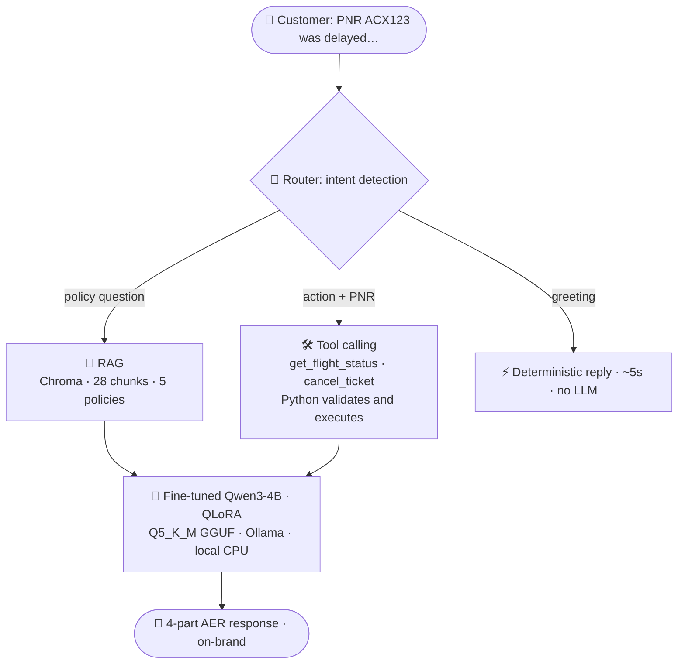

<div align="center">

# ✈️ ACME Airlines Support AI

**A hybrid customer-support agent that speaks on-brand, cites real policy, and takes live action.**

*Fine-tuned local LLM for tone · RAG for facts · tool calling for actions — in one FastAPI endpoint.*


-000000?logo=ollama&logoColor=white)


</div>

---

## 🎯 The one idea

> Fine-tuning teaches a model **how to speak**. It does **not** teach it what's true — it will invent
> policies with total confidence. RAG pins answers to real documents. Tools handle live data.
> **Each layer fixes the exact failure mode of the one before it** — and this repo builds that
> failure → fix chain on purpose, then *measures* it.

---

## 🔥 See it in action — the same question, before vs. after RAG

**Customer:** *"My flight was delayed 5 hours. What compensation do I get?"*

<table>
<tr>
<th>🚫 Fine-tuned model alone</th>
<th>✅ Fine-tuned model + RAG</th>
</tr>
<tr>
<td valign="top">

Perfect tone… **wrong facts.**

> "…you are entitled to a **full refund** under
> our delay policy #4…"

*Invented "policy #4." No such thing.
Confident. Wrong. Un-shippable.*

</td>
<td valign="top">

Same tone… **grounded in canon.**

> "…as per ACME Bharat Airlines policy, a delay
> of 4–6 hours entitles you to a **₹3,000 travel
> voucher**…"
> `📄 source: delay-compensation-policy.md`

*Exact policy value. Cited. Shippable.*

</td>
</tr>
</table>

**Live-update proof:** edited the refund window `7 → 5 business days` in the policy doc, rebuilt the
index, re-asked — the bot answered **"5 business days"** with **zero retraining**. That's the whole
point of RAG over fine-tuning for facts.

---

## 🏗️ Architecture



> **tone ← fine-tune · facts ← RAG · actions ← tools** — each layer fixes the previous one's failure mode.

---

## 🛠️ Built in 8 stages (the full LLM lifecycle)

| # | Stage | The interesting part |
|:-:|---|---|
| 1 | **Prompting baseline** | Gemini + persona config — exposes tone control *and* hallucination |
| 2 | **Synthetic data** | 240 pairs · 12 scenario buckets · AER 4-part template · resilience stack (pacing + 429 backoff + fallback model + resume) survived two live 429 bursts |
| 3 | **QLoRA fine-tune** | Qwen3-4B-Instruct 4-bit on a **free Colab T4** · r=16 · 7 modules · **33M trainable (0.81%)** |
| 4 | **Quantize + serve** | merge 16-bit → GGUF f16 → **Q5_K_M (2.7 GB)** → **Ollama on Windows CPU** · zero API cost |
| 5 | **RAG layer** | structure-aware chunking → Chroma + MiniLM · turns "invents policy" into "cites canon" |
| 6 | **Tool calling** | router → JSON → **Python validates & executes** → responder grounds the reply · *the model never runs code* |
| 7 | **Hybrid API** | FastAPI `/v1/chat` routes RAG / tool / clarify · output cleaning · trace logging |
| 8 | **Eval harness** | held-out set → local outputs → **Gemini LLM-as-judge** on 5 AER criteria, calibrated on gold answers first |

---

## 📊 The eval harness

Every response scored **1/0** on five criteria by an LLM judge (`src/evals/judge.py`):

| Criterion | Passes if the reply… |
|---|---|
| 🫱 **empathy** | opens with a sincere acknowledgement |
| 🔀 **options** | offers 2–3 concrete options (refund / rebook / voucher / escalate) |
| 📚 **policy_note** | states a policy-safe line ("as per ACME policy…") |
| ➡️ **next_step** | ends with exactly one clarifying question |
| 🛡️ **no_invented_data** | fabricates **no** PNRs, names, or case numbers |

**Trust the ruler before you measure:** the judge is first `--calibrate`d against the *gold*
reference answers (it should score them ~100%). A judge that can't grade the answer key can't
grade the student. Free-tier survival built in: request pacing + **429/503 retry with exponential
backoff** + resume files.

---

## ⚖️ Honest limitations *(kept on purpose — they are the roadmap)*

- 🧩 The 4B model sometimes **blends retrieved facts with invented policy** on the tool path → *reflection agent + stricter grounding next*
- 🔒 One cancel reply asked a customer for **"bank details"** → *motivates an output-guardrail blocklist*
- 🌀 Occasional **garbage leading tokens** from the quantized model → filtered at the app layer
- ⏱️ CPU latency: deterministic clarify **~5 s** vs LLM paths **36–86 s** → *quantifies why deterministic routing matters*

> A project that documents its own failure modes is more credible than one that claims perfection.

---

## ▶️ Run it

```bash
# 1 · environment
python -m venv .venv && .venv\Scripts\activate
pip install -r requirements.txt

# 2 · local model  (needs Ollama + the Q5_K_M GGUF from stage 4)
ollama create acme-support -f data/processed/Modelfile

# 3 · build the RAG index
python src/rag/build_index.py

# 4 · serve  → Swagger UI at http://localhost:8000/docs
uvicorn src.api.main:app --port 8000
```

---

## 🧰 Stack

| Category | Technologies |
|---|---|
| 🧠 **Model & fine-tuning** | Qwen3-4B-Instruct · Unsloth QLoRA · llama.cpp GGUF/Q5_K_M · Ollama |
| 🔎 **RAG** | ChromaDB · MiniLM embeddings |
| 🛠️ **Serving & tools** | FastAPI · mock backend (flight status / cancel) |
| 📊 **Data & eval** | Gemini (synthetic data + LLM-judge) |

## 🗺️ Roadmap

Eval harness *(in progress)* → output guardrails → **ACME MCP server** → **LangGraph reflection agent** → feedback-to-DPO loop

<div align="center">

---

*Built as a hands-on study of the full LLM lifecycle: data → fine-tune → quantize → serve → RAG → tools → API → eval.*

</div>
