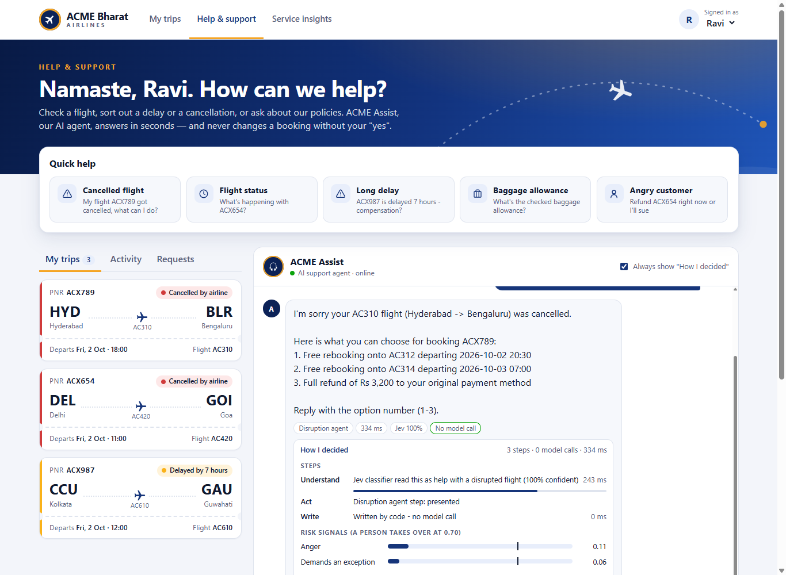
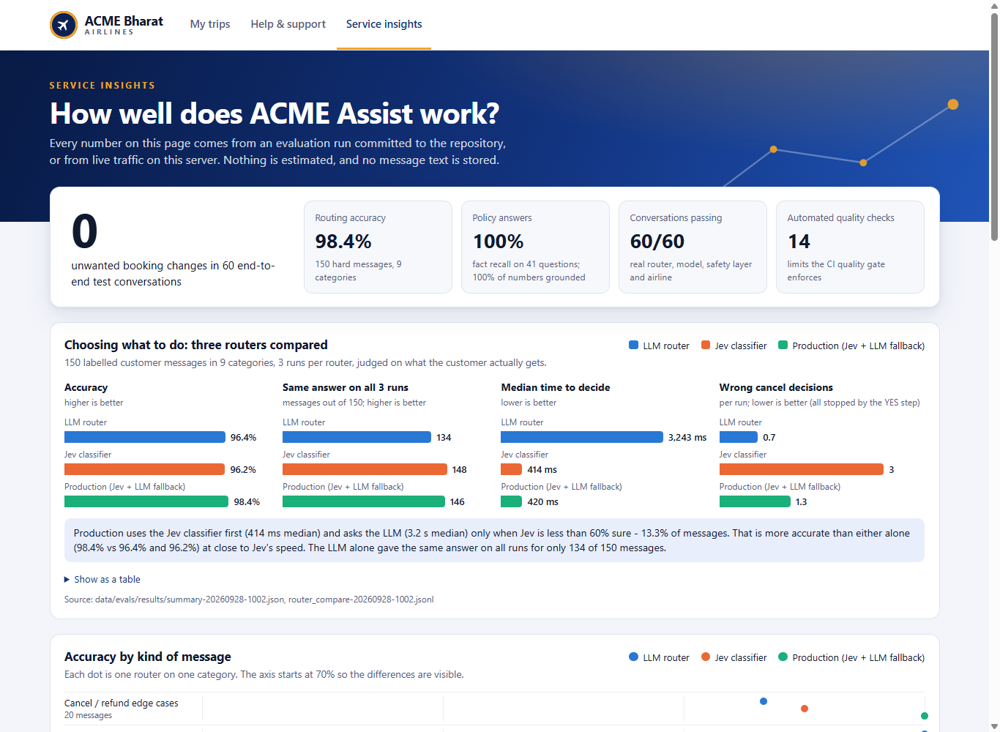
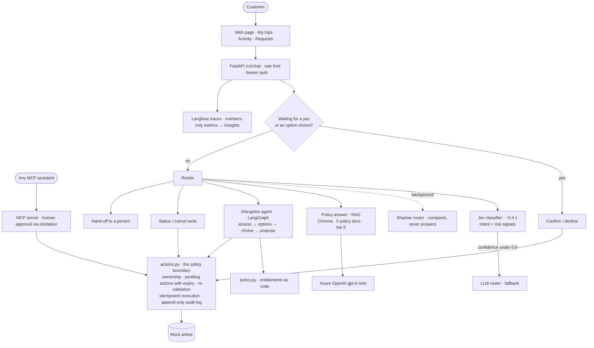

<div align="center">

# ✈️ ACME Assist — an AI support agent that can safely change bookings

**Answers policy questions, checks flights, cancels bookings and resolves disruptions for a
(fictional) Indian airline — and never changes anything without the customer's "yes".**

[](https://github.com/Khatalahmed/acme-ai-support/actions/workflows/tests.yml)
[](https://github.com/Khatalahmed/acme-ai-support/actions/workflows/ai-quality-gate.yml)


### [▶ Try the live demo](https://acme-support.livelycliff-81dc5d47.eastus.azurecontainerapps.io) &nbsp;·&nbsp; [📊 Service insights](https://acme-support.livelycliff-81dc5d47.eastus.azurecontainerapps.io/insights)

<sub>The first visit after a quiet spell takes ~30 s while the server wakes up.</sub>

</div>



---

## Why this project

Most chatbot demos answer questions. Real support agents **take actions** — cancel a ticket, refund a
fare, rebook a flight — and that is where things go wrong: the model misreads "what happens *if* I
cancel?", promises a refund the policy doesn't allow, or acts on someone else's booking.

This project is built around that problem:

- **The model never decides what a customer is owed.** Entitlements are policy-as-code
  ([`policy.py`](src/policy.py)); the model only explains them.
- **The model can't change a booking.** Every change is *proposed*, stored server-side, and runs
  only after the customer's explicit "yes" — re-checked at the moment it executes.
- **Every claim is measured.** A 150-message routing benchmark, a 41-question RAG set and 20
  multi-turn conversations run in CI against fixed limits — including **zero tolerance for an
  unwanted action**.

## Results (measured, not estimated)

| What | Result | How it was measured |
|---|---|---|
| Unwanted booking changes | **0** in 60 conversations | 20 multi-turn scenarios × 3 runs through the real router, model, safety layer and airline |
| Actions carried out when they should be | **18 / 18** | same conversations, judged on the final booking state |
| Hand-offs to a person when needed | **9 / 9** | same conversations |
| Routing accuracy | **98.4%** (LLM alone 96.4%) | 150 labelled messages in 9 categories × 3 runs |
| Median time to route a message | **420 ms** (LLM alone 3.2 s) | same benchmark |
| Policy answers: facts correct | **100%** on 2/2 runs | 37 answerable questions, deterministic string checks — no AI grading AI |
| Invented numbers in answers | **0 / 41** | every number must appear in the retrieved policy text |
| Unanswerable questions refused | **4 / 4** | questions the policies don't cover |
| **AI quality gate on GitHub** | **14 / 14 checks passed** | [`ai-quality-gate.yml`](.github/workflows/ai-quality-gate.yml), limits in [`gate.json`](data/evals/gate.json) |

Source files for every number are in [`data/evals/results/`](data/evals/results/), and the live
[Service insights](https://acme-support.livelycliff-81dc5d47.eastus.azurecontainerapps.io/insights)
page is generated from them by [`build_insights.py`](src/evals/build_insights.py) — a test fails if
the page and the files ever disagree.



## What it can do — try these on the live demo

Sign in as **Asha** or **Ravi** (simulated sign-in; each has their own bookings).

| Try | What happens |
|---|---|
| *"My flight ACX789 got cancelled, what can I do?"* (Ravi) | The **disruption agent** works out his entitlement from policy code and offers 2 rebookings or a ₹3,200 refund — then waits |
| Reply *"3"*, then **Yes** | Refund executes; the trip card shows *"Refunded Rs 3,200"*; the Activity tab shows every step |
| *"Cancel ACX456"* then **No** (Asha) | Nothing changes — and the "no" is in the audit log too |
| *"Cancel ACX789"* (Asha) | Refused: it's Ravi's booking. Someone else's booking and a missing one get the **same** answer, so PNRs can't be probed |
| *"Refund ACX654 right now or I'll sue"* (Ravi) | A risk signal crosses 0.70 → handed to a person with a ticket, nothing changed |
| *"What's the checked baggage allowance?"* | Answered from the policy documents, with sources |

Under every reply, **"How I decided"** shows what actually happened — built by code from the request,
not written by a model: which router read the message and how confident it was, what the agent did,
every model call with its real time and token count, the risk signals and the safety checks.

## Architecture


```mermaid
flowchart TD
    U([Customer]) --> WEB[Web page · My trips · Activity · Requests]
    WEB --> API[FastAPI /v1/chat · rate limit · bearer auth]
    MCPC([Any MCP assistant]) --> MCP[MCP server · human approval via elicitation]

    API --> P{Waiting for a yes<br/>or an option choice?}
    P -- yes --> CONF[Confirm / decline]
    P -- no --> R[Router]

    R --> JEV[Jev classifier · ~0.4 s<br/>intent + risk signals]
    JEV -- confidence under 0.6 --> LLMR[LLM router · fallback]
    R -.background.-> SH[Shadow router · compares, never answers]

    R --> RAG[Policy answer · RAG<br/>Chroma · 5 policy docs · top 5]
    R --> AG[Disruption agent · LangGraph<br/>assess → options → choice → propose]
    R --> T[Status / cancel tools]
    R --> H[Hand-off to a person]

    AG --> POL[policy.py · entitlements as code]
    AG --> ACT
    T --> ACT
    CONF --> ACT
    MCP --> ACT
    ACT[actions.py · the safety boundary<br/>ownership · pending actions with expiry · re-validation<br/>idempotent execution · append-only audit log] --> AIR[(Mock airline)]

    RAG --> LLM[Azure OpenAI gpt-5-mini]
    API --> OBS[Langfuse traces · numbers-only metrics → /insights]
```

**The safety boundary is the tool layer, not the prompt.** Everything that reads or changes a
booking — the chat API, the disruption agent and the MCP server — goes through
[`actions.py`](src/actions.py):

- **Ownership:** a booking is visible only to its owner; "not yours" looks exactly like "doesn't exist".
- **Server-side confirmation:** a change becomes a *pending action* for that user and conversation,
  expiring after 5 minutes; only a clear "yes" in the same conversation runs it.
- **Claim-then-execute:** a double-clicked "yes" can't run twice (compare-and-set on the pending action).
- **Re-validation at execution:** seats, entitlement and ownership are checked again when it runs.
- **Append-only audit log:** every proposal, yes, no, expiry, refusal and hand-off — shown to the
  customer on the Activity tab in plain language.

## What measuring found — and what fixed it

Each problem was measured first, changed, then measured again on the same set (router fixes on
held-out messages written *before* the change, so the fix couldn't be tuned to the test).

| Found | Fix | Before → after |
|---|---|---|
| An LLM-written opening line took 15.7 s of a 16.3 s request (1,984 hidden reasoning tokens) — and a guardrail discarded it every time | Opening line written by code from the booking | **16.25 s → 0.49 s**, cost per reply $0.0042 → $0.00002 |
| "What happens *if* I cancel?" was routed as a cancellation | Cancel only on a clear instruction; exception demands go to a person | held-out accuracy **81.7% → 100%**; on the 150-message set, wrong cancels **4.7 → 1.3** per run |
| "Refund me or I'll sue" reached a person only when it was misrouted | Demanding an exception escalates on any route | exception held-out **91.7% → 100%** |
| Policy answers missed a fact when the right section ranked 4th–5th | Top 5 sections, low reasoning effort | fact recall **94.6% → 100%**, median **8.1 s → 3.9 s** |
| Status replies searched the policies with the customer's words | Look the section up by name from the booking's state | right section **7/21 → 21/21** |
| An on-time status reply offered "status alerts" and recited raw JSON | Plain-language facts, own system prompt, closing line written by code | conversations passing **57/60 → 60/60** |
| Answers printed "Policy answer:" headings and opened with an apology *(seen on the live site; every accuracy metric was 100%)* | Prompt rewritten; the gate now checks for headings | answers with headings **33/41 → 0/41** |
| Asking again about a resolved booking offered options that no longer existed | Reply written from the booking record | **3.9 s → 0.3 s**, no model call |

## Router benchmark

Three routers on the same 150 labelled messages, 3 runs each:

| Router | Accuracy | Same answer on all 3 runs | Median | Wrong cancels / run | Escalation precision |
|---|---|---|---|---|---|
| LLM (gpt-5-mini) | 96.4% | 134 / 150 | 3,243 ms | 0.7 | 86.8% |
| Jev classifier | 96.2% | 148 / 150 | 414 ms | 3.0 | 94.4% |
| **Production: Jev, LLM when Jev < 60% sure** | **98.4%** | 146 / 150 | **420 ms** | 1.3 | **100%** |

Production asks the LLM for 13.3% of messages. **It doesn't win everywhere:** the LLM router alone
is better on typos (100% vs 93.3%) and prompt injection (100% vs 93.3%); production is better on
tool manipulation (96.7% vs 76.7%) and cancel/refund edge cases (100% vs 93.3%). Every wrong cancel
decision was stopped by the confirmation step.

In production, **shadow mode** runs the other router on real traffic in the background, records every
disagreement in Langfuse, and turns it into a labelled benchmark case — so the test set grows from
real messages, not just ones I wrote.

## Quality gates

| Gate | When | What |
|---|---|---|
| **Tests** — [`tests.yml`](.github/workflows/tests.yml) | every PR and push to main | 290 offline tests: safety layer, agent, policy, API, MCP, pages, metrics — no network, no keys |
| **AI quality gate** — [`ai-quality-gate.yml`](.github/workflows/ai-quality-gate.yml) | weekly, on release tags, or manually | real conversations, RAG and router benchmark against [`gate.json`](data/evals/gate.json): 5 zero-tolerance checks (0 unwanted actions, 100% action and escalation recall, 100% grounded numbers, 100% refusals) plus quality floors |

## Tech stack

| Area | Used |
|---|---|
| Agent & tools | LangGraph (state machine with `interrupt()`, SQLite checkpoints), FastAPI, MCP Python SDK |
| Models | Azure OpenAI gpt-5-mini (answers, fallback routing), TypeSafe Jev (typed intent + risk classifier) |
| Retrieval | ChromaDB, MiniLM embeddings, 5 policy documents |
| Observability | Langfuse (traces, costs, shadow-mode scores and datasets), numbers-only request metrics |
| Evaluation | Deterministic evals for routing, RAG and tool use; versioned CI gate |
| Front end | Plain HTML/CSS/JS, no build step; light/dark, phone-friendly, accessible tabs and disclosures |
| Delivery | uv, Docker (non-root, no secrets in the image), Azure Container Apps, GitHub Actions |

## Run it locally

```bash
uv sync                                   # Python 3.13 environment from uv.lock
cp .env.example .env                      # then fill in the Azure OpenAI + TypeSafe keys
uv run python src/rag/build_index.py      # build the policy index
uv run uvicorn src.api.main:app --port 8000
```

Open <http://localhost:8000> for the site, `/insights` for the results, `/docs` for the API.

```bash
uv run pytest                                          # 290 offline tests, no keys needed
uv run python src/evals/gate.py                        # the full AI quality gate (uses the API keys)
uv run python src/evals/router_compare.py --runs 3     # router benchmark
ACME_MCP_TOKEN=demo-asha uv run python src/mcp_server.py   # MCP server (stdio)
```

Docker: `docker build -t acme-support .` then `docker run -p 8000:8000 --env-file .env -e DEMO_MODE=true acme-support`.
Keys are injected at runtime (Azure Container Apps secrets in production), never baked into the image.

## Project layout

```
src/
  api/main.py         FastAPI app: chat flow, pages, bookings, activity, insights
  actions.py          the safety boundary: ownership, pending actions, audit log, hand-offs
  policy.py           disruption entitlements as code, with the policy sections they cite
  agent.py            LangGraph disruption-recovery agent
  router.py           Jev + LLM routing, risk signals, fallback
  shadow.py           shadow-mode router comparisons
  decision_trace.py   the "How I decided" panel, built from what happened
  activity.py         the audit log as plain sentences for the Activity tab
  insights.py         numbers-only live metrics
  mcp_server.py       MCP server with human approval through elicitation
  evals/              router, RAG and tool evaluations, the gate, the insights builder
  web/                the two pages and the shared stylesheet
data/
  policies/           the airline's policy documents (RAG source)
  evals/              labelled test sets, gate limits, committed results
tests/                offline test suite
```

## Honest limitations

- **Simulated sign-in and a mock airline.** Demo tokens, not real authentication; bookings live in memory.
- **One server replica.** The rate limiter and demo state are in-process; scaling out would need
  shared state (Redis or Postgres) first.
- **Cold starts.** The app scales to zero, so the first visit after a quiet spell takes ~30 s and
  live statistics reset.
- **Router weak spots** (see the benchmark): typos and prompt injection; a hyphenated PNR
  ("ACX-456") isn't recognised.
- **Hinglish retrieval** relies on top-5 retrieval with an English-only embedding model; a
  multilingual model is the planned fix.
- **Test sets were written by me.** Shadow mode adds real-traffic disagreements for labelling, but
  most cases are not yet from real customers.
- **No streaming yet** — policy answers take ~4 s before any text appears.

## How it started

The project began as a study of the whole LLM lifecycle: synthetic training data (240 examples),
a QLoRA fine-tune of Qwen3-4B on a free Colab T4, quantised to GGUF and served locally with Ollama,
then RAG, tool calling and an LLM-judge evaluation. That showed the core lesson — **fine-tuning
teaches tone, not facts** — and the local model is still supported (`LLM_BACKEND=ollama`). The
current version moved generation to Azure OpenAI and focused on what production support agents
need: safe actions, measured quality and visibility into every decision. The full plan and
decision log are in [`PLAN.md`](PLAN.md).

---

<div align="center">
<sub>ACME Bharat Airlines is a fictional airline built for this portfolio project. Flights, bookings and
sign-in are simulated; no real payments or personal data are processed.</sub>
</div>
